# AI-Integrated Portable Spectrofluorometer

### Quantitative Detection of Microplastic Contamination Using Carbon Dot Fluorescent Paper Probes

<p align="center">
  <strong>Portable Raspberry Pi based UV fluorescence imaging system for low-cost contaminant screening</strong>
</p>

<p align="center">
  
  
  
  
  
</p>

**NIT Rourkela — Integrated M.Sc. Chemistry**
**Amit Kumar** — Roll No. `421CY5075`
**Supervisor:** Prof. Sasmita Mohapatra
**Co-supervisor:** Prof. Samit Ari

---

## Project Snapshot

<p align="center">
  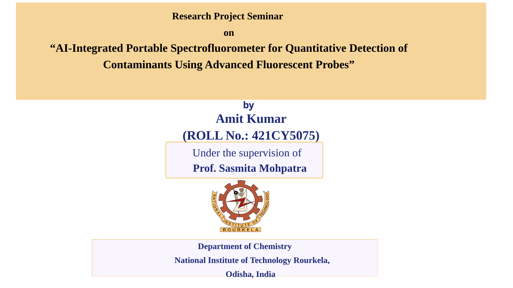
</p>

This project develops a **battery-powered portable UV spectrofluorometer** for quantitative detection of polystyrene microplastic contamination using **carbon dot fluorescent probes**. The system replaces a bulky laboratory spectrofluorometer with a compact setup built using a **Raspberry Pi 4B**, **Pi Camera Module 3**, **UV LEDs**, a **MOSFET-controlled excitation circuit**, and a **hand-fabricated dark chamber**.

The sensing element is a low-cost disposable paper strip coated with a **carbon dot + PVP + polyacrylamide composite**. Under UV excitation, the coated strip emits blue-green fluorescence. When polystyrene microplastic interacts with the probe, the fluorescence response changes in a concentration-dependent manner. A Python–Streamlit app extracts image-based fluorescence metrics and applies calibration models to estimate contaminant concentration.

**Best experimental result:** `129.6 ppm` predicted vs `130 ppm` actual polystyrene concentration in milk, corresponding to approximately `0.3%` error under the tested calibration condition.

> [!IMPORTANT]
> This repository is a research prototype for academic demonstration. It is **not an approved food-safety, environmental-monitoring, or medical diagnostic device**. Results must be validated with standard analytical instrumentation and controlled multi-sample experiments before real-world use.

---

# Problem We Solved

<p align="center">
  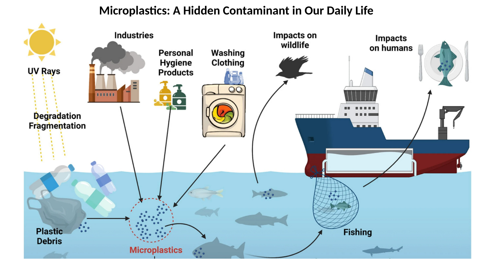
</p>

Microplastics are difficult to monitor because they can enter water and food systems through daily-use plastic degradation, washing processes, environmental runoff, and industrial discharge. Conventional analytical methods can be expensive, bulky, laboratory-dependent, and less accessible for field-level screening.

This project solves a practical instrumentation problem:

> **Can we build a low-cost portable device that captures fluorescence from a chemical probe and converts the image signal into a quantitative contaminant concentration?**

The answer demonstrated here is a compact workflow:

```text
Carbon dot fluorescent probe
        ↓
Disposable coated paper strip
        ↓
UV excitation inside dark chamber
        ↓
Raspberry Pi camera image acquisition
        ↓
RGB fluorescence metric extraction
        ↓
Linear calibration and unknown concentration prediction
```

---

# Scientific Basis

## Fluorescence Detection Strategy

<p align="center">
  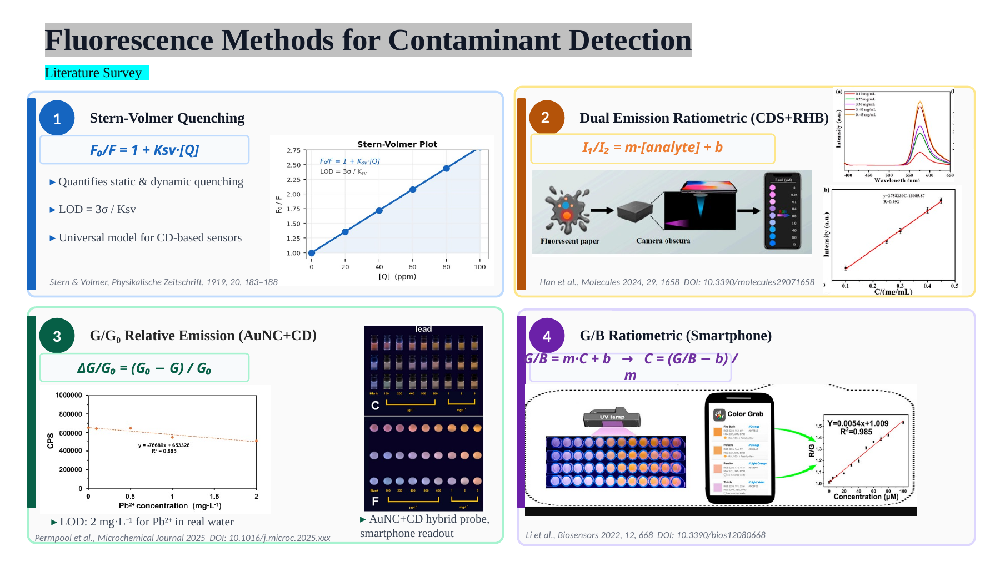
</p>

The project is based on established fluorescence sensing ideas:

| Method                     | Core equation                   | Why it matters here                                               |
| -------------------------- | ------------------------------- | ----------------------------------------------------------------- |
| **Stern–Volmer quenching** | `F₀/F = 1 + Ksv[Q]`             | Relates fluorescence change to quencher concentration             |
| **Relative emission**      | `G/G₀` or `ΔG/G₀ = (G₀ − G)/G₀` | Normalizes fluorescence against a blank reference                 |
| **Ratiometric sensing**    | `G/B = mC + b`                  | Uses channel ratio to reduce exposure and illumination dependency |
| **Calibration inversion**  | `C = (signal − b) / m`          | Converts measured image signal into predicted concentration       |

In this project, the image captured by the Pi Camera is treated as a fluorescence signal source. Instead of measuring emission intensity with a conventional spectrofluorometer, the app analyzes the RGB pixel intensities inside the fluorescent strip region.

---

# Fluorescent Disposable Strip Fabrication

<p align="center">
  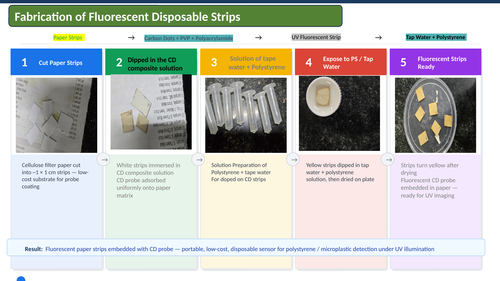
</p>

The sensing strip fabrication follows a simple low-cost process:

1. **Cut cellulose filter paper** into approximately `1 × 1 cm` pieces.
2. **Prepare carbon dot composite solution** using carbon dots, PVP, and polyacrylamide.
3. **Dip paper strips** into the carbon dot composite solution so the probe adsorbs into the paper matrix.
4. **Prepare polystyrene test solution** in tap water or milk matrix.
5. **Expose coated strips** to known or unknown polystyrene concentration.
6. **Dry the strips** and image them under UV illumination.

The final output is a disposable fluorescent paper probe that can be placed inside the dark chamber for UV imaging.

---

# Hardware Development

<p align="center">
  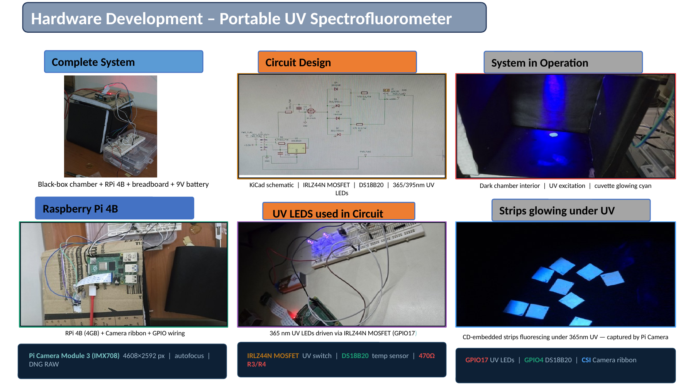
</p>

The hardware was designed to keep the optical path simple, reproducible, and portable.

## Hardware Components

| Component                      | Function                                                              |
| ------------------------------ | --------------------------------------------------------------------- |
| **Raspberry Pi 4B**            | Central controller for image capture, GPIO control, and app execution |
| **Pi Camera Module 3**         | Captures fluorescence images from the strip inside the dark chamber   |
| **UV LEDs**                    | Provide excitation source for carbon dot fluorescence                 |
| **IRLZ44N MOSFET**             | Switches UV LEDs using Raspberry Pi GPIO control                      |
| **DS18B20 temperature sensor** | Monitors chamber temperature for safety and stability                 |
| **9 V battery**                | Powers the UV LED excitation circuit                                  |
| **Dark chamber**               | Reduces ambient-light interference during fluorescence imaging        |
| **Breadboard / PCB circuit**   | Connects LEDs, MOSFET, resistors, sensor, and GPIO pins               |

## GPIO Mapping

| Signal           | Raspberry Pi GPIO | Purpose                                     |
| ---------------- | ----------------: | ------------------------------------------- |
| UV LED control   |            GPIO17 | Drives MOSFET gate for LED ON/OFF switching |
| Temperature data |             GPIO4 | DS18B20 1-Wire data line                    |
| Sensor VDD       |             3.3 V | Powers the temperature sensor               |
| Ground           |               GND | Common ground for Pi and circuit            |

## Circuit Logic

The Raspberry Pi does not directly power the UV LEDs. Instead, GPIO17 controls the gate of the IRLZ44N MOSFET. When GPIO17 goes HIGH, the MOSFET switches the LED circuit ON. When GPIO17 goes LOW, the LED circuit turns OFF. This protects the Pi and allows a separate 9 V LED supply.

---

# Software Pipeline — RGB Fluorescence Analyzer

<p align="center">
  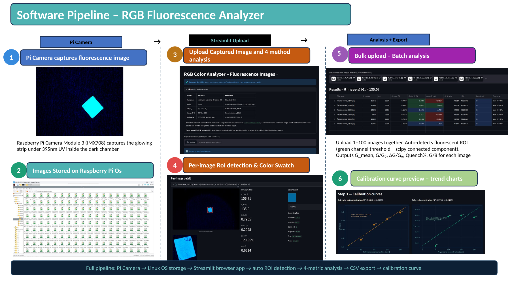
</p>

The software pipeline converts a fluorescence image into numerical chemical information.

```text
Pi Camera capture
        ↓
Image saved on Raspberry Pi OS
        ↓
Upload image/images into Streamlit app
        ↓
Auto-detect fluorescent ROI
        ↓
Extract RGB metrics
        ↓
Fit calibration curve
        ↓
Predict unknown concentration
        ↓
Export CSV tables and equations
```

## Hardware Script — `hardware/spectrofluorometer.py`

The hardware script runs on the Raspberry Pi and controls measurement acquisition:

1. Reads DS18B20 temperature.
2. Checks that the chamber temperature is safe.
3. Turns UV LEDs ON using GPIO17.
4. Waits for fluorescence stabilization.
5. Captures a fluorescence image using Pi Camera Module 3.
6. Saves image files with auto-numbered filenames.
7. Turns UV LEDs OFF and cleans up GPIO.

Example:

```bash
cd hardware/
python3 spectrofluorometer.py
```

## Streamlit App — `software/app.py`

The Streamlit app provides three main analysis modes:

### 1. Calibration

* Upload known-concentration fluorescence images.
* Enter concentration values in ppm.
* Automatically detect the fluorescent strip ROI.
* Extract fluorescence metrics.
* Fit linear calibration models.
* Display calibration equation, `R²`, p-value, and curve.

### 2. Predict Unknown

* Upload one unknown fluorescence image.
* Extract the same image metrics.
* Apply the saved calibration equation.
* Back-calculate concentration.
* Display step-by-step algebra and the unknown point on the calibration curve.

### 3. Data and Export

* View the full results table.
* Inspect residuals and prediction errors.
* Download CSV results and equation summaries.

Run the app:

```bash
cd software/
streamlit run app.py
```

---

# Image Processing Method

The app detects the fluorescent region using the green channel because the carbon dot strips emit a blue-green response under UV light.

A simplified version of the analysis logic is:

```text
Input RGB image
        ↓
Separate R, G, B channels
        ↓
Use green-channel thresholding
        ↓
Detect connected fluorescent component
        ↓
Crop region of interest around strip
        ↓
Compute fluorescence metrics
```

## Fluorescence Metrics

| Metric     | Formula                     | Meaning                                     |
| ---------- | --------------------------- | ------------------------------------------- |
| `G_mean`   | Mean green intensity in ROI | Raw green-channel fluorescence response     |
| `G/G₀`     | `G_mean / G₀`               | Normalized green response relative to blank |
| `ΔG/G₀`    | `(G₀ − G_mean) / G₀`        | Fractional quenching or relative change     |
| `Quench %` | `100 × ΔG/G₀`               | Percentage-level quenching response         |
| `G/B`      | `ΣG / ΣB`                   | Ratiometric green-to-blue response          |

Here, `G₀ = 135.0` was used as the blank reference value in the displayed experiments.

---

# Calibration Results

## 1. Tap Water + Polystyrene using `G/G₀`

<p align="center">
  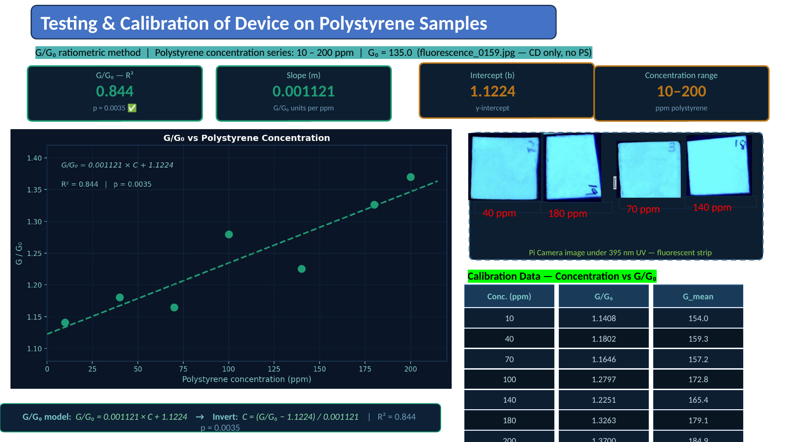
</p>

| Parameter            |                            Value |
| -------------------- | -------------------------------: |
| Concentration range  |                     `10–200 ppm` |
| Calibration equation |   `G/G₀ = 0.001121 × C + 1.1224` |
| Inverted equation    | `C = (G/G₀ − 1.1224) / 0.001121` |
| R²                   |                          `0.844` |
| p-value              |                         `0.0035` |

The positive slope indicates a concentration-dependent increase in the normalized green-channel fluorescence response across the tested polystyrene concentration range.

## 2. Tap Water + Polystyrene using `G/B`

<p align="center">
  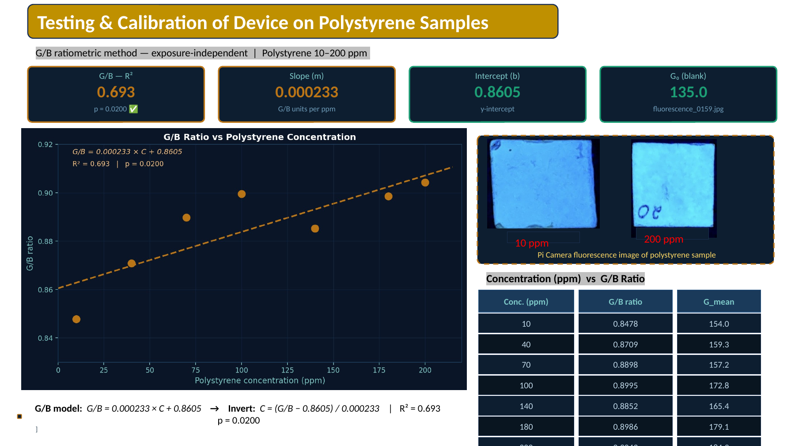
</p>

| Parameter            |                           Value |
| -------------------- | ------------------------------: |
| Concentration range  |                    `10–200 ppm` |
| Calibration equation |   `G/B = 0.000233 × C + 0.8605` |
| Inverted equation    | `C = (G/B − 0.8605) / 0.000233` |
| R²                   |                         `0.693` |
| p-value              |                        `0.0200` |

The `G/B` method is ratiometric, so it is less dependent on absolute brightness than raw intensity alone. In the tap-water experiment, the `G/G₀` model showed a stronger linear fit than the `G/B` model.

## 3. Milk + Polystyrene using `G/B`

<p align="center">
  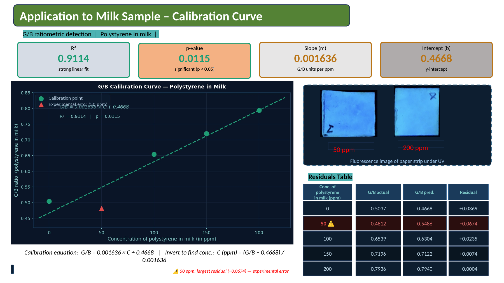
</p>

| Parameter            |                           Value |
| -------------------- | ------------------------------: |
| Matrix               |                            Milk |
| Calibration equation |   `G/B = 0.001636 × C + 0.4668` |
| Inverted equation    | `C = (G/B − 0.4668) / 0.001636` |
| R²                   |                        `0.9114` |
| p-value              |                        `0.0115` |
| Largest residual     |                 `50 ppm` sample |

The milk calibration produced the strongest displayed linear relation, with `R² = 0.9114`. The 50 ppm sample showed the largest residual and was marked as a likely experimental-error point in the presentation.

---

# Unknown Milk Sample Prediction

<p align="center">
  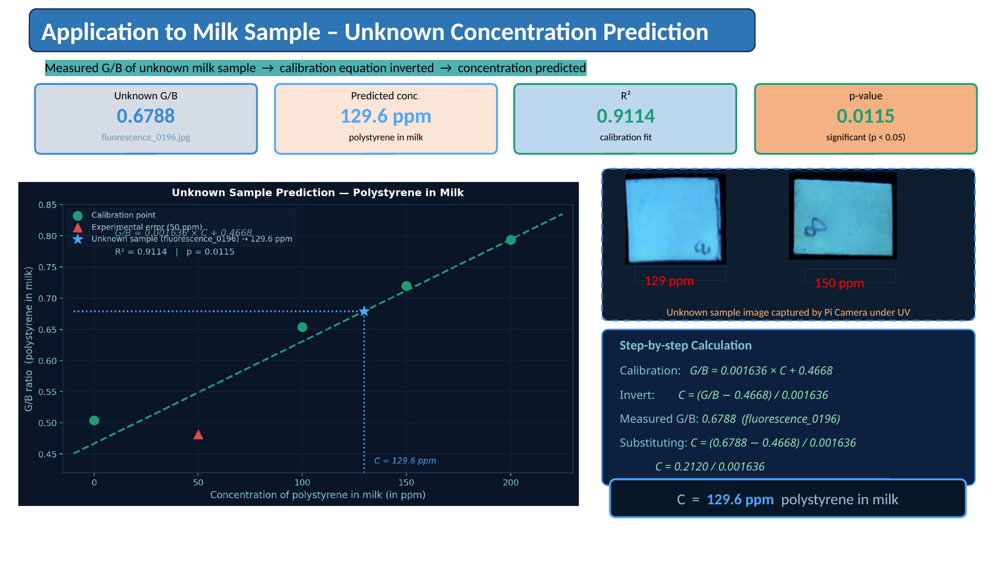
</p>

The unknown milk sample was predicted using the milk `G/B` calibration equation.

## Calculation

```text
Calibration equation:     G/B = 0.001636 × C + 0.4668
Invert equation:          C = (G/B − 0.4668) / 0.001636
Measured unknown G/B:     0.6788
Substitution:             C = (0.6788 − 0.4668) / 0.001636
                          C = 0.2120 / 0.001636
Predicted concentration:  C = 129.6 ppm
```

## Result

| Item                    |                   Value |
| ----------------------- | ----------------------: |
| Unknown image           | `fluorescence_0196.jpg` |
| Measured `G/B`          |                `0.6788` |
| Predicted concentration |             `129.6 ppm` |
| Actual concentration    |               `130 ppm` |
| Approximate error       |                  `0.3%` |

This result demonstrates the core objective of the project: an image captured by a Raspberry Pi fluorescence setup can be converted into a quantitative contaminant estimate through calibration.

---

# Complete Presentation Snapshot

<p align="center">
  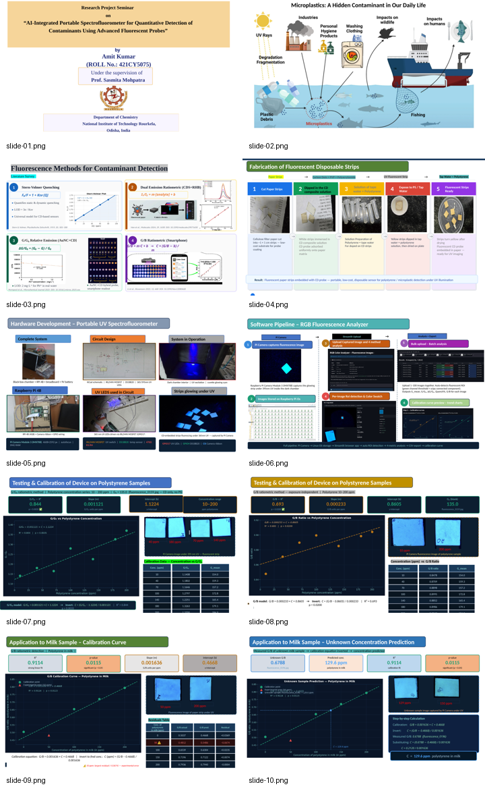
</p>

The README includes slide snapshots so that a new reader can quickly understand the complete project flow: problem, sensing principle, probe fabrication, portable hardware, software pipeline, calibration, and unknown concentration prediction.

---

# Repository Structure

```text
spectrofluorometer/
│
├── hardware/
│   └── spectrofluorometer.py     # Raspberry Pi control script
│                                 # UV LEDs, camera, temperature sensor
│
├── software/
│   └── app.py                    # Streamlit fluorescence analyser
│                                 # ROI detection, calibration, prediction
│
├── circuit/
│   ├── schematic.png             # KiCad circuit schematic
│   ├── bom.csv                   # Bill of Materials
│   └── pin_mapping.md            # J1 header → Raspberry Pi GPIO mapping
│
├── docs/
│   └── Thesis.pdf                # Full thesis / project report
│
├── assets/
│   └── readme/                   # README figures extracted from presentation
│
├── requirements.txt              # Python dependencies
└── README.md
```

---

# Installation

## On Raspberry Pi

Enable the 1-Wire interface for the DS18B20 sensor:

```bash
sudo raspi-config
# Interface Options → 1-Wire → Enable
```

Install dependencies:

```bash
pip install streamlit numpy opencv-python-headless Pillow pandas scipy matplotlib --break-system-packages
pip install RPi.GPIO --break-system-packages
```

Run the hardware capture script:

```bash
cd hardware/
python3 spectrofluorometer.py
```

Run the Streamlit analysis app:

```bash
cd software/
streamlit run app.py
```

Open the browser URL printed by Streamlit. On Raspberry Pi, this is usually:

```text
http://localhost:8501
```

## On PC or Laptop

For analysis only, the hardware-specific packages are not required.

```bash
pip install -r requirements.txt
cd software/
streamlit run app.py
```

---

# Typical Usage

## 1. Capture Fluorescence Images

Place the coated strip inside the dark chamber and run:

```bash
python3 hardware/spectrofluorometer.py
```

The script captures fluorescence images under UV illumination and saves them for analysis.

## 2. Build Calibration Curve

Open the Streamlit app and upload images of known concentrations. Enter the corresponding ppm values. The app extracts fluorescence metrics and fits the selected calibration model.

## 3. Predict Unknown Concentration

Upload an unknown sample image. The app extracts the selected metric and applies the inverted calibration equation to estimate the concentration.

## 4. Export Results

Download calibration tables, residuals, predicted values, and equation summaries as CSV files.

---

# Key Technical Contributions

1. **Low-cost fluorescence imaging device** built using Raspberry Pi hardware and UV LEDs.
2. **Disposable fluorescent paper-strip probe** prepared using carbon dot composite coating.
3. **Dark-chamber imaging setup** to reduce ambient-light noise.
4. **GPIO-controlled UV excitation circuit** using MOSFET-based switching.
5. **Streamlit-based RGB fluorescence analysis app** for calibration and unknown prediction.
6. **Automated ROI detection** using green-channel thresholding and connected-component analysis.
7. **Multiple fluorescence metrics** including `G_mean`, `G/G₀`, `ΔG/G₀`, quench percentage, and `G/B` ratio.
8. **Quantitative calibration models** for polystyrene in tap water and milk matrices.
9. **Blind unknown sample prediction** demonstrating 129.6 ppm predicted concentration for a 130 ppm milk sample.

---

# Deep Learning Extension

A future direction is to replace handcrafted RGB metrics with a lightweight deep learning model trained directly on fluorescence images.

Planned direction:

```text
Fluorescence image dataset
        ↓
Lightweight CNN / MobileNetV2 backbone
        ↓
Attention and multi-scale fusion blocks
        ↓
Regression or classification output
        ↓
TensorFlow Lite conversion
        ↓
Raspberry Pi deployment
```

Possible deep learning tasks:

* classify concentration ranges,
* regress exact contaminant concentration,
* detect poor-quality or out-of-distribution images,
* learn robust features across lighting, camera exposure, and matrix variation,
* deploy an optimized TFLite model on Raspberry Pi.

---

# Limitations

* Calibration was demonstrated on limited controlled samples; more replicates are needed.
* The model may be sensitive to strip preparation, drying time, LED intensity, camera distance, camera exposure, and chamber geometry.
* Milk and water matrices behave differently, so a calibration curve from one matrix should not be directly reused for another.
* The system currently uses image intensity as a proxy for fluorescence intensity; it is not a replacement for a calibrated laboratory spectrofluorometer.
* The present workflow does not identify polymer type; it estimates concentration for the tested polystyrene setup.
* Long-term probe stability, repeatability, limit of detection, limit of quantification, and inter-day reproducibility require further validation.

---

# References

1. Stern, O.; Volmer, M. *Physikalische Zeitschrift* **1919**, *20*, 183–188.
2. Han et al. *Molecules* **2024**, DOI: `10.3390/molecules29071658`.
3. Permpool et al. *Microchemical Journal* **2025**.
4. Li et al. *Biosensors* **2022**, DOI: `10.3390/bios12080668`.
5. Liu et al. *ACS Central Science* **2020**, DOI: `10.1021/acscentsci.0c01306`.
6. Chen et al. *Environmental Science & Technology Letters* **2021**, DOI: `10.1021/acs.estlett.1c00483`.
7. Wang et al. *Sensors and Actuators B: Chemical* **2022**, DOI: `10.1016/j.snb.2022.132347`.

---

# License

MIT License — free to use, modify, and distribute with attribution.

---

# Acknowledgement

This work was carried out as part of the research project seminar at the Department of Chemistry, National Institute of Technology Rourkela, under the supervision of **Prof. Sasmita Mohapatra** and co-supervision of **Prof. Samit Ari**.
